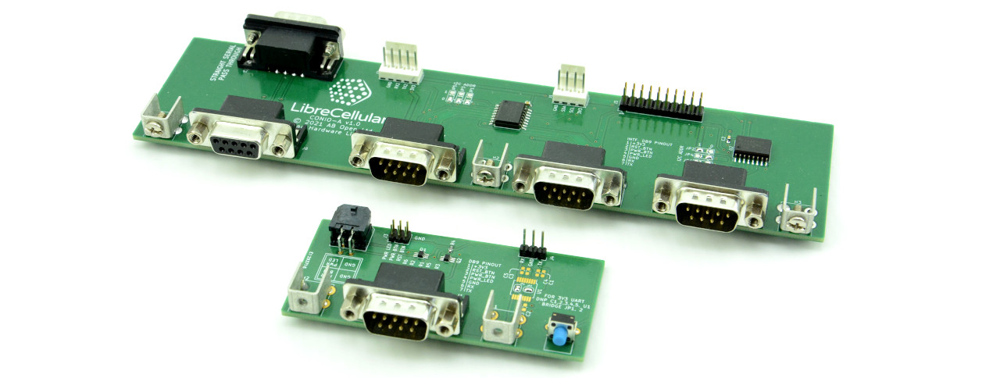

.. _ci_hardware:

CI Hardware Platform
====================

This page is presently a skeleton and detailed information will be added in due
course.

Subsystems
----------

The subsystems listed below will be housed in a single 19" equipment rack. Each
subsystem is comprised of numerous components.

RFTST
^^^^^

RF test and measurement.

CIHOST
^^^^^^

Continous integration (CI) host. This will be used to automate software build
and test.

* `HPE ProLiant DL20 Gen10`_ (P17079-B21).
* 16GB RAM.
* 2x 2TB HDD.

TSTCON
^^^^^^

.The test controller unit:

* Provides remote console and power/reset control for base stations.
* Drives LTE modem banks.

It is comprised of:

* APU2E4 embedded PC.
* CONIO-A console IO board (A end).

RANLS1
^^^^^^

LimeSDR base station #1.

This is comprised of the Reference Hardware Platform:

* Intel NUC7i7DNBE SBC.
* CONIO-B console IO board (B end).
* LimeSDR-USB.

With the notable exception of the LimeRFE board or any other sort of RF power
amplifier or LNA.

RANLS2
^^^^^^

LimeSDR base station #2.

A cost-optimised base station comprised of:

* UP2 Atom x7-E3950 or similar board.
* CONIO-B console IO board (B end).
* LimeSDR Mini.

CLKDST
^^^^^^

Clock distribution. This takes a GPS reference and distributes it to the SDR
base stations and RF test equipment. Consisting of:

* `TADD-1`_ RF distribution amplifier.
* `TADD-3`_ PPS amplifier.

RF44AT
^^^^^^

4x to 4x RF splitter/combiner, plus digitally controlled attenuation. 

Up to four modem banks may be connected on one side, with up to four base
stations on the other side. The signal routed to and from each base station may
be individually attenuated, so as to test operating under varying conditions and
to trigger handover.

Components:

* 2x 4:1 RF splitter/combiner
* `sysmoRFDSATT-4-62`_

MOD8SQ
^^^^^^

A bank of 8x LTE modems.

Components:

* 2x `sysmoQMOD`_ boards.
* 8x LTE modems.

MOD4QV
^^^^^^

4x LTE modem bank with VoLTE support.

Components:

* 4x `Quectel Mini PCIe EVB`_ boards.
* 4x `Quectel EC25`_ Mini PCIe modules.

*Audio test capabilities TBC.*

DCPSU1
^^^^^^

A common DC power supply rated to provide:

* 12V @ 50A
* 5V @ 12A

Components
----------

CONIO-A
^^^^^^^

Remote console, reset and power control — controller end.

CONIO-B
^^^^^^^

Remote console, reset and power control — base station end.

.. _HPE ProLiant DL20 Gen10:
   https://buy.hpe.com/uk/en/servers/proliant-dl-servers/proliant-dl20-servers/proliant-dl20-server/hpe-proliant-dl20-gen10-server/p/1011028697

.. _TADD-1: https://tapr.org/product/tadd-1-rf-distribution-amplifier/

.. _TADD-3: https://tapr.org/product/tadd-3-pulse-per-second-distribution-amplifier/

.. _sysmoRFDSATT-4-62: https://www.sysmocom.de/products/lab/rfdsatt/index.html

.. _sysmoQMOD: https://www.sysmocom.de/news/sysmoqmod/index.html

.. _Quectel Mini PCIe EVB: https://www.quectel.com/product/mini-pcie-evb-kit/

.. _Quectel EC25: https://www.quectel.com/product/lte-ec25-e-minipcie/
