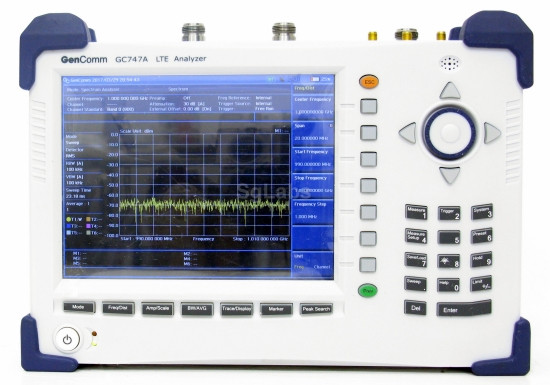
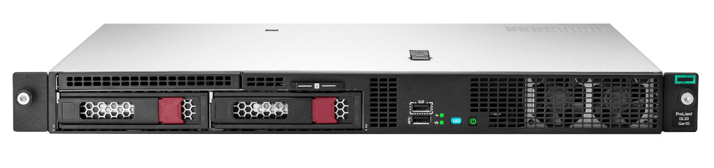

.. figure:: images/LC_CI_Hardware_Header_1280w.jpg

CI Hardware Platform
====================

The continous integration hardware platform provides provides a combination of
base stations and modem banks, with cabled RF and splitter/combiner network with
variable attenuation, plus support infrastructure such as clock distribution,
interfacing and control.

The CI hardware is modular in nature and housed in a 19" equipment rack.

Subsystems
----------

The CI platform is comprised of numerous subsystems and these are listed below,
with details provided for the main components used in each. Links are provided
for further details of COTS/third party components used, while details of
original components developed as part of this project can be found at the bottom
of this page.

A comprehensive bill of materials, together with mechanical CAD files and
drawings for the enclosures, will be published in due course.

RFTST
^^^^^

A GenComm GC747A will be used for RF test and measurement.

Typical measurements include:

* RF power
* Adjacent channel power ratio (ACPR)
* Error vector magnitude (EVM)

CIHOST
^^^^^^

Continous integration (CI) host. This will be used to automate software build
and test.

Specifications:

* `HPE ProLiant DL20 Gen10`_ (P17079-B21).
* 16GB RAM.
* 2x 2TB HDD.

TSTCON
^^^^^^

The test controller unit:

* Provides remote console and power/reset control for base stations.
* Drives LTE modem banks.

It is comprised of:

* `APU2E4`_ embedded PC.
* :ref:`CONIO-A<CONIO-A>` console IO board.

RANLS1
^^^^^^

LimeSDR base station #1.

This is comprised of the Reference Hardware Platform:

* `Intel NUC7i7DNBE`_ SBC.
* :ref:`CONIO-B<CONIO-B>` console IO board.
* `LimeSDR-USB`_.

With the notable exception of the LimeRFE board or any other sort of RF power
amplifier or LNA.

RANLS2
^^^^^^

LimeSDR base station #2.

A cost-optimised base station comprised of:

* `UP2 Atom x7-E3950`_ or similar board.
* :ref:`CONIO-B<CONIO-B>` console IO board.
* `LimeSDR Mini`_.

CLKDST
^^^^^^

Clock distribution. This takes a GPS reference and distributes it to the SDR
base stations and RF test equipment. Consisting of:

* `TADD-1`_ RF distribution amplifier.
* `TADD-3`_ PPS amplifier.

RF44AT
^^^^^^

4x to 4x RF splitter/combiner, plus digitally controlled attenuation. 

Up to four modem banks may be connected on one side, with up to four base
stations on the other side. The signal routed to and from each base station may
be individually attenuated, so as to test operating under varying conditions and
to trigger handover.

Components:

* 2x 4:1 RF splitter/combiner
* `sysmoRFDSATT-4-62`_

MOD8SQ
^^^^^^

A bank of 8x LTE modems.

Components:

* 2x `sysmoQMOD`_ boards.
* 8x LTE modems.

MOD4QV
^^^^^^

4x LTE modem bank with VoLTE support.

Components:

* 4x `Quectel Mini PCIe EVB`_ boards.
* 4x `Quectel EC25`_ Mini PCIe modules.

*Audio test capabilities TBC.*

DCPSU1
^^^^^^

A common DC power supply rated to provide:

* 12V @ 50A
* 5V @ 12A

Components
----------

.. _CONIO-A:

CONIO-A
^^^^^^^

Remote console, reset and power control — controller (A) end.

.. _CONIO-B:

CONIO-B
^^^^^^^

Remote console, reset and power control — base station  (B) end.

.. _HPE ProLiant DL20 Gen10:
   https://buy.hpe.com/uk/en/servers/proliant-dl-servers/proliant-dl20-servers/proliant-dl20-server/hpe-proliant-dl20-gen10-server/p/1011028697

.. _APU2E4: https://pcengines.ch/apu2e4.htm

.. _Intel NUC7i7DNBE: https://ark.intel.com/content/www/us/en/ark/products/130394/intel-nuc-board-nuc7i7dnbe.html

.. _LimeSDR-USB: https://limemicro.com/products/boards/limesdr/

.. _UP2 Atom x7-E3950: https://up-board.org/upsquared/specifications/

.. _LimeSDR Mini: https://limemicro.com/products/boards/limesdr-mini/

.. _TADD-1: https://tapr.org/product/tadd-1-rf-distribution-amplifier/

.. _TADD-3: https://tapr.org/product/tadd-3-pulse-per-second-distribution-amplifier/

.. _sysmoRFDSATT-4-62: https://www.sysmocom.de/products/lab/rfdsatt/index.html

.. _sysmoQMOD: https://www.sysmocom.de/news/sysmoqmod/index.html

.. _Quectel Mini PCIe EVB: https://www.quectel.com/product/mini-pcie-evb-kit/

.. _Quectel EC25: https://www.quectel.com/product/lte-ec25-e-minipcie/
