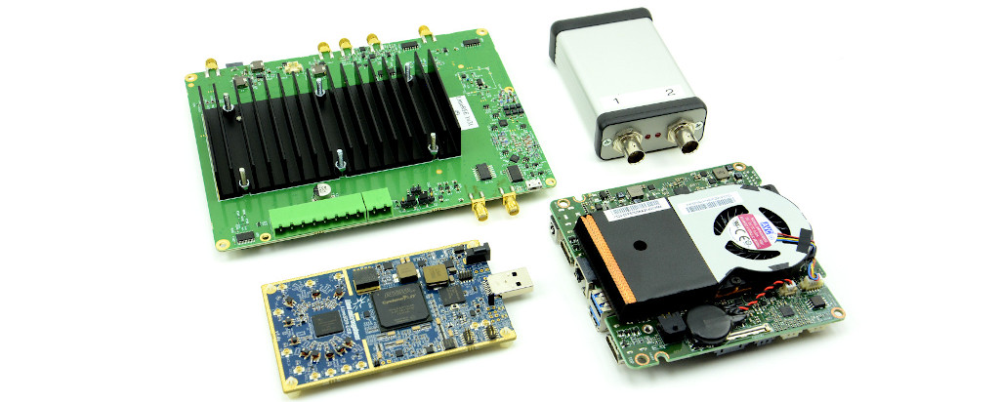

.. toctree::
   :maxdepth: 2
   :hidden:

   Welcome <self>
   introduction/index
   user/index
   developer/index
   faq

Welcome
=======

The LibreCellular project aims to make it easier to create 4G cellular networks
with open source software and low cost software-defined radio (SDR) hardware.
Seeking to achieve this via validated hardware and software configurations that
are subjected to rigorous testing, together with additional tooling and
documentation for repeatable deployment.

LibreCellular builds on the work of numerous existing open source software
and hardware projects, related to both the cellular platform itself and
associated test infrastructure. Where necessary additional components are
developed, with any software source code and hardware designs published under
open source licences. The focus is very much on integration, testing, packaging
and documentation, reusing and building upon existing solutions.

LibreCellular is hosted as a `MyriadRF <https://myriadrf.org>`_ project.

Recent changes
--------------

.. git_changelog::

