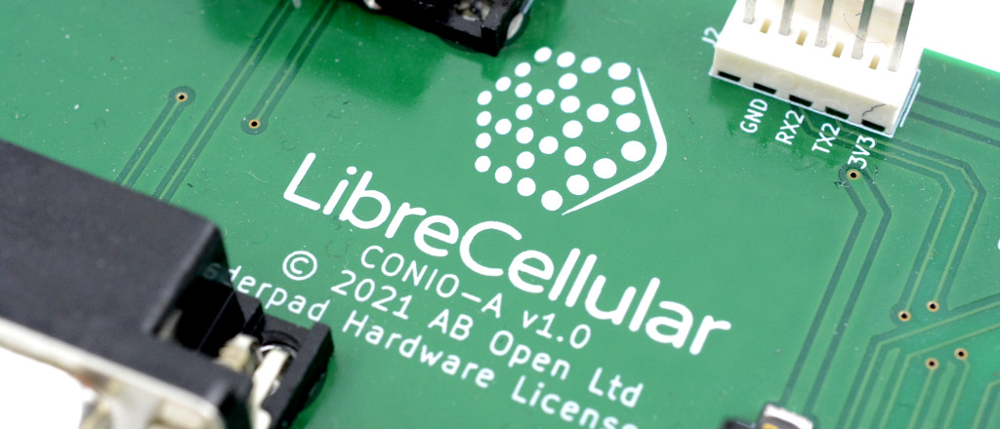

Introduction
============

LibreCellular uses commodity compute hardware together with software-defined
radio to create a highly flexible LTE base station, where the cellular core
network may optionally run alongside this for a fully self-contained solution. A
reference hardware platform will be provided, together with validated software
versions and configuration to enable repeatable deployment. 

The main use is envisaged as low power small cells, configured for typical
bandwidths of 1.4MHz and 3MHz, operating in `Ofcom Shared Access`_ and `CBRS`_
spectrum. These networks will initially support a data service only, but support
for native voice dialling via VoLTE — aka "HD voice" — is planned, along with
potentially circuit-switched fallback (CSFB) also at some point in the future. 

Roadmap
-------

The project is split at a high level into four initial phases, with the first
being concerned with building out the CI hardware platform. This will be
followed by CI configuration and test, support for basic LTE data service, and
then support for native voice calling over LTE.

Continous Integration (CI) Hardware
^^^^^^^^^^^^^^^^^^^^^^^^^^^^^^^^^^^

The CI platform integrates one or more test base stations with LTE modem
banks via a cabled RF network, with reference clock distribution, control, and
RF measurement.

This is the current development focus and see :doc:`/developer/hardware/index` for details.

CI Platform Configuration and Test
^^^^^^^^^^^^^^^^^^^^^^^^^^^^^^^^^^ 

Automated testing will be made possible via use of the `OsmoGSMTester`_ software. Test coverage will be extended over time as the project develops.

Basic Service
^^^^^^^^^^^^^

Upon completion of this phase it will be possible to provision subscribers,
connect user equipment (handsets or other terminals) to the network and use this
to transfer data.

Voice over LTE (VoLTE) Service
^^^^^^^^^^^^^^^^^^^^^^^^^^^^^^

An IP Multimedia Subsystem (IMS) will be integrated to enable native voice calling using the network.

Software Stack
--------------

The key software components in the provisional stack are summarised below, but
this is by no means a comprehensive list and is subject to change.

eNodeB
^^^^^^

The 4G base station component will be provided by `srsRAN`_.

Evolved Packet Core (EPC)
^^^^^^^^^^^^^^^^^^^^^^^^^

It is planned to use `Open5Gs`_ to provide the core network.

IP Multimedia Subsystem
^^^^^^^^^^^^^^^^^^^^^^^

It is intended to use `Kamailio`_ for the IMS.

Reference Hardware Platform
---------------------------

Given that ease of use is a key aim, having a validated reference hardware
platform is important and should save a lot of time getting new users up and
running. In addition to which, this will make it much easier to rule out
hardware problems when issues do arise.

The initial reference hardware is specified with a reasonable degree of headroom
in terms of performance and flexibility, which clearly has cost implications and
a future cost-optimised version is also anticipated.

Baseband Processing
^^^^^^^^^^^^^^^^^^^

An Intel `NUC7i7DNBE`_ SBC will be used for baseband processing and running the
upper layers of the cellular stack.

.. note::
    Other SBCs will also be validated and this is just the first board that is being targeted.

SDR Hardware
^^^^^^^^^^^^

The original `LimeSDR-USB`_ board has been selected for the SDR hardware.

.. note::
    On 1st June 2022 it was announced that the original LimeSDR board would be discontinued. However, a limited supply will be made available for the LibreCellular project and contributors and it was always planned for LimeSDR Mini support to follow, which should equally work with v1 and v2 boards. 

RF Front End
^^^^^^^^^^^^

`LimeRFE`_ will be used to provide a multi-band RF front-end complete with LNAs,
PAs and duplexers. This provides a modulated output of 24dBm on cellular bands
1, 2, 3, 4 and 5.

Reference Clock
^^^^^^^^^^^^^^^

The LimeSDR will utilise a Leo Bodnar `Mini Precision GPS Reference Clock`_
reference for frequency stability and accuracy.

.. _NUC7i7DNBE: https://ark.intel.com/content/www/us/en/ark/products/130394/intel-nuc-board-nuc7i7dnbe.html
.. _LimeSDR-USB: https://wiki.myriadrf.org/LimeSDR-USB
.. _LimeRFE: https://www.crowdsupply.com/lime-micro/limerfe
.. _Mini Precision GPS Reference Clock: http://www.leobodnar.com/shop/index.php?main_page=product_info&cPath=107&products_id=301
.. _OsmoGSMTester: https://osmocom.org/projects/osmo-gsm-tester
.. _Ofcom Shared Access: https://www.ofcom.org.uk/manage-your-licence/radiocommunication-licences/shared-access
.. _CBRS: https://en.wikipedia.org/wiki/Citizens_Broadband_Radio_Service
.. _srsRAN: https://www.srsran.com/
.. _Open5Gs: https://open5gs.org/
.. _Kamailio: https://www.kamailio.org/
